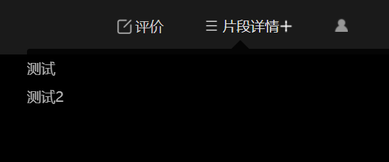
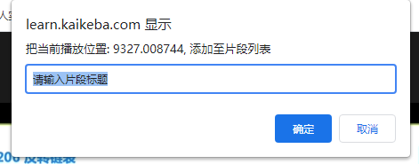
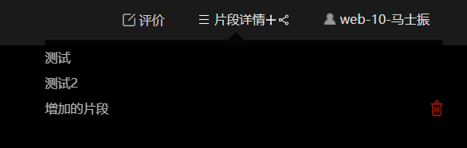
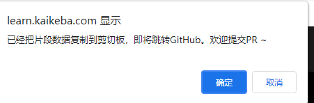

# kaikeba-crx

开课吧-视频片段插件，仅供学习交流

## chrome插件

- 功能

从仓库获取视频片段信息，并展示。点击可以调转播放



点击上图+号，增加片段



增加片段会存放在localStorage内，可以进行删除



点击2图分享图标，可以自动拷贝片段信息。




- 开发

```shell
yarn
npm run dev
```

然后打开chrome浏览器拓展管理 [chrome://extensions/](chrome://extensions/)

点击左上角【加载已解压的拓展程序】，再选择该项目根目录

- 测试

打开 开课吧课程播放页面，https://learn.kaikeba.com/video/xxxxxx


## 片段数据维护

course目录存放片段数据，可根据课程、章节、小结自行创建目录

片段文件的数据格式为

```json
{
	"id": "视频id，即 https://learn.kaikeba.com/video/ 后的数值" ,
	"fragments": [
		{
			"title": "片段名称",
			"timestamp": 100
		}
	]
}

```

## 欢迎大家提交pr，共同维护插件和课程片段信息

## TODO LIST

- [ ] 直播时，获取直播时间，维护片段信息
- [ ] 视频进度条显示片段
- [ ] github ci， 自动合并片段信息
